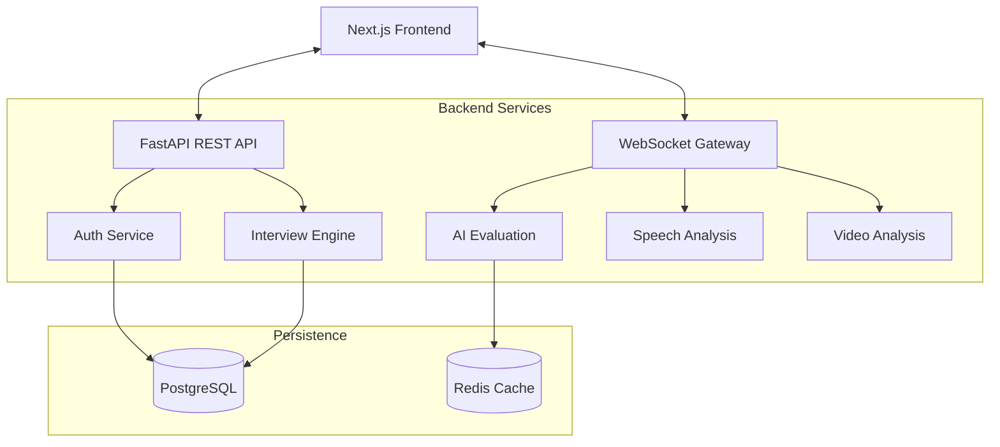

# 🚀 AI Interview Coach – Real-Time Feedback System

An elite, production-grade SaaS platform designed to revolutionize interview preparation. This system provides **real-time**, actionable feedback on speech patterns, content quality, and behavioral cues using state-of-the-art AI models.


## 🧠 Overview
AI Interview Coach is not a simple demo—it's a startup-grade platform built with scalability, low latency, and deep intelligence at its core. It simulates live interviews (voice + video) and analyzes responses instantly across four dimensions:
1.  **Speech Intelligence**: Clarity, pace, filler words, and prosody.
2.  **Content Analysis**: Technical accuracy, STAR method alignment, and relevance.
3.  **Behavioral Tracking**: Eye contact, emotion detection, and posture.
4.  **Confidence Scoring**: Integrated metric derived from voice and video.

---

## ✨ Key Features
-   🎤 **Live Interview Room**: Immersive WebRTC-powered simulation with real-time video/audio streaming.
-   ⚡ **Instant Feedback**: Live "Confidence Meter" and transcript updates during the session.
-   🧠 **AI Evaluation Engine**: Deep LLM-driven scoring (0-10) with specific strengths and improvements.
-   👁️ **Computer Vision Module**: Client-side MediaPipe integration for eye-contact and emotion tracking.
-   📊 **Advanced Analytics**: Detailed performance trends, weakness detection, and score history.
-   🧩 **Adaptive Questioning**: AI adjusts question difficulty based on candidate performance.
-   💰 **SaaS Ready**: Built-in JWT auth, Pro/Free role system, and Stripe billing hooks.

---

## 🏗️ System Architecture

### High-Level Design
Built as a **Modular Monolith** for rapid deployment, with clear domain boundaries for easy extraction into microservices.



### Real-Time Pipeline
-   **Audio Pipeline**: `< 500ms` latency (Audio -> Whisper STT -> LLM Feedback).
-   **Video Pipeline**: `< 1000ms` latency (Frames -> MediaPipe -> Emotion/Eye Tracking).

---

## 🛠️ Tech Stack
| Component | Technology | Rationale |
| :--- | :--- | :--- |
| **Backend** | FastAPI | Native async support for WebSockets and superior performance. |
| **Frontend** | Next.js 14 | App Router for SEO and server-side rendering capability. |
| **Styling** | Tailwind CSS | Rapid UI development with premium design tokens. |
| **AI/ML** | GPT-4o / Whisper | State-of-the-art reasoning and speech-to-text. |
| **Database** | PostgreSQL | Robust relational data handling with JSONB support. |
| **Caching** | Redis | Low-latency session state and rate limiting. |
| **DevOps** | Docker | Consistent environment across development and production. |

---

## 🚀 Getting Started

### 1. Prerequisites
-   Docker and Docker Compose
-   OpenAI API Key

### 2. Installation
```bash
# Clone the repository
git clone https://github.com/your-username/ai-interview-coach.git
cd ai-interview-coach

# Setup environment variables
cp backend/.env.example backend/.env
# Edit backend/.env and add your OPENAI_API_KEY
```

### 3. Run with Docker
```bash
docker-compose up --build
```
The application will be available at:
-   **Frontend**: `http://localhost:3000`
-   **Backend Docs**: `http://localhost:8000/api/v1/docs`

---

## 🔐 Security & Auth
-   **JWT Authentication**: Stateless, secure user sessions.
-   **Password Hashing**: Bcrypt with salt for database security.
-   **Rate Limiting**: IP-based throttling to prevent abuse.
-   **CORS**: Strict origin validation for API access.

---

## 📊 Scaling Roadmap (1M Users)
1.  **Phase 1 (MVP)**: Single VPS, OpenAI API, basic analytics.
2.  **Phase 2 (Growth)**: Kubernetes deployment, Redis cluster, Celery task queue for heavy AI jobs.
3.  **Phase 3 (Scale)**: Multi-region DB replicas, self-hosted GPU nodes for Whisper/Vision, edge caching via CloudFlare.

---

## 💰 Cost Optimization
-   **Client-side CV**: MediaPipe runs in the user's browser, saving GPU server costs.
-   **LLM Caching**: Redis caches common question evaluations to reduce API tokens.
-   **Tiered Inference**: Use GPT-4o-mini for Free tier and GPT-4o for Pro.

---

## 📜 License
This project is licensed under the MIT License - see the LICENSE file for details.

---

## 👤 Author
**Staff AI Engineer & SaaS Architect**
*Building the future of career intelligence.*
